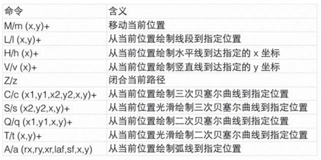
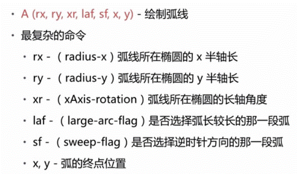

# CSS3笔记
css3的新特性：选择器、盒模型、圆角、盒子阴影，重要的三大模块：变形、过渡、动画

## 选择器

### 属性选择器
属性选择器的兼容是从IE7开始兼容，所以目前大部分都可以使用
- el[attr] 选择具有attr属性的元素
- el[attr="value"] 选择attr属性的值为value的元素，两个条件都满足：attr、value
- el[attr*="value"] 选择attr属性值中包含value的元素
- el[attr^="value"] 选择attr属性值以value开头的元素
- el[attr$="value"] 选择attr属性值以value结尾的元素
- el[attr~="value"] 选择attr属性值为value或者value是一个单独独立的部分(如:以空格分隔的)
- el[attr|="value"] 选择attr属性值为value或者是以value-开头的元素

属性选择器中的属性是可以一次性写多个，即满足多个属性:el[attr1][attr2]

### 关系选择器
通过元素之间的关系来进行选择
- el1 el2 后代选择器，所有浏览器都兼容
- el1>el2 元素1的儿子或者女儿，IE7开始兼容
- el1+el2 元素1后面紧挨着元素2，兼容同上
- el1~el2 元素1后面的所有直接子元素，兼容同上

### 伪类选择器
- :root 选择文档根标签(同html标签选择器)
- el:nth-child(n) 选择元素是其父元素的第n个孩子，IE9开始支持
- el:first-child 选择元素是其父元素的第一个子元素，IE7开始支持
- el:last-child 选择元素是其父元素的最后一个子元素，IE9开始支持
- el:nth-last-child(n) 选择元素是其父元素倒数第n个子元素
- el:only-child 选择元素是其父元素的独生子女元素，即只有一个孩子
- el:nth-child(2n) el:nth-child(even) 选择元素是其父元素中排行为偶数的的孩子
- el:nth-child(2n+1) el:nth-child(odd) 选择元素是其父元素中排行为奇数的的孩子
- el:nth-child(-n+3) 选择元素是在其父元素中排行前三的子元素

- el:nth-of-type(n) 选择元素在其父元素中的同类孩子中的第n个孩子
- el:first-of-type 选择元素在其父元素中的同类孩子中排行第一的孩子
- el:nth-last-of-type(n) 选择元素为其父元素中的同类孩子中倒数第n个孩子
- el:only-of-type 选择元素为其父元素中的同类孩子中唯一一个孩子
- el:nth-of-type(2n) el:nth-of-type(even)  选择元素为其父元素中的同类孩子中为偶数的孩子
- el:nth-of-type(2n+1) el:nth-of-type(odd)  选择元素为其父元素中的同类孩子中为奇数的孩子
- el:nth-of-type(-n+2) 选择元素为其父元素中的同类孩子中排行前二的孩子

- :hover 鼠标悬停，IE6只支持a元素，从IE7开始所有元素都支持hover
- :active 激活状态时，IE6和7中只支持a，IE8开始所有元素支持
- el:focus 元素获取焦点时，IE8开始兼容
- el:checked 表单元素被选中时
- el:disabled 表单元素禁用时
- el:enabled 表单元素可用时
- :lang(zh) 当处于某种语言时，IE8开始支持
- :empty 选中没有子元素的元素
- :not(css选择器) 取反
- :target 锚记处于当前状态时

以上选择器中如果没有标注则从IE9开始支持。

### 伪元素选择器
- el:before el::before 在元素的所有子元素前，一个冒号的写法从IE8开始支持，两个从IE9开始支持
- el:after el::after  在元素的所有子元素后，同上
- el:first-letter el::first-letter 元素的第一个字符，一个冒号的写法从IE6开始支持，两个从IE9开始支持
- el:first-line el::first-line 元素的第一行，同上
- ::selection 元素被选中时，IE9开始支持，设置个别的元素需要直接作用于元素身上，如果所有元素都要则设置为全局的即::selection

## 新属性

### 颜色
- rgba()  a表示不透明度，1表示完全不透明，0表示完全透明
- hsl()  h色相 s饱和度 l亮度
- hsla() h色相 s饱和度 l亮度 a不透明度

### 圆角
标准表示法：border-radius:px | %，通常为了兼容都需要加上兼容前缀
- 设置一个值 表示四个角圆角相同
- 设置两个值 第一个值表示左上和右下角，第二个值表示右上和左下角
- 设置三个值 第一个值为左上角，第二个值为右上和左下，第三个值为右下
- 设置四个值 从左上角开始，顺时针依次设置

也可以单独给每个角设置：
- border-top-left-radius 左上角
- border-top-right-radius 右上角
- border-bottom-left-radius 左下角
- border-bottom-right-radius 右下角

如果是一个正方形，其圆角值大于或者等于宽高一半时变成一个正圆
如果是一个长方形，其圆角值大于或者等于宽高一半时变成一个胶囊圆角
如果设置百分比，横向为盒子宽度的百分比，纵向为盒子高度的百分比，如果是长方形其值大于或者等于50%变成一个椭圆

### 阴影

#### 盒子阴影
box-shadow：右 下 羽化值(模糊程度) 延展度 阴影颜色 inset(内阴影)
- 阴影默认字体的颜色
- 阴影不占空间
- 一个盒子可以有多个阴影
- 盒子阴影从IE9开始支持

#### 文字阴影
text-shadow:右 下 羽化值(模糊程度) 阴影颜色
- 文字阴影没有延展度和内外阴影，其他和盒子阴影一样
- 文字阴影从IE10开始支持

### 背景
- background-color 背景色
- background-image 背景图
- background-repeat 背景图平铺
- background-position 背景图定位
- background-attachment 设置背景图是否随滚动条滚动而滚动，默认值scroll，fixed表示固定
- background-origin 背景起源，padding-box背景定位相对于内边距盒子，border-box相对于边框盒子定位，content-box相对于内容盒子定位
- background-clip 背景裁剪，padding-box背景按照内边距盒子裁剪，border-box按照边框盒子裁剪，content-box按照内容盒子裁剪，通常和background-origin搭配使用
- background-size:px | % | cover | contain 背景大小,默认以原始大小呈现，取值设置为px则按照设置来呈现；设置百分比则宽度为盒子宽度的百分比，高为盒子高度的百分比；设置为百分比和auto则为百分比按照设置方向的百分比，auto方向则为自动等比缩放；设置为cover则为缩放背景图刚好覆盖盒子；设置为contain保证显示一张完整图片的情况下缩放盒子到等宽或等高

#### 背景渐变
- background-image:linear-gradient(开始和结束位置方位名称或者度数(deg)，颜色值1，颜色值2....) 线性渐变
ps:对于线性渐变如果写方位名称w3c标准和WHATWG的写法不一样，w3c是在方位名称前加to 结束方位名称，WHATWG则是起始方位名称，如果写数值也不一样，两者坐标系不同，所以起始度数要不相同，如下图：

例子：
~~~
div:first-child{
    background-image:-webkit-linear-gradient(left,red,blue);
    background-image:-moz-linear-gradient(left,red,blue);
    background-image:-ms-linear-gradient(left,red,blue);
    background-image:-o-linear-gradient(left,red,blue);
    background-image:linear-gradient(to right,red,blue);
}
div:nth-child(3){
    background-image:-webkit-linear-gradient(left top,red,blue);
    background-image:-moz-linear-gradient(left top,red,blue);
    background-image:-ms-linear-gradient(left top,red,blue);
    background-image:-o-linear-gradient(left top,red,blue);
    background-image:linear-gradient(to right bottom,red,blue);
}
div:nth-child(5){
    background-image:-webkit-linear-gradient(top,red,blue,orange,green);
    background-image:-moz-linear-gradient(top,red,blue,orange,green);
    background-image:-ms-linear-gradient(top,red,blue,orange,green);
    background-image:-o-linear-gradient(top,red,blue,orange,green);
    background-image:linear-gradient(to bottom,red,blue,orange,green);
}
div:nth-child(6){
    background-image:-webkit-linear-gradient(top,red,blue 20%,orange,green 240px);
    background-image:-moz-linear-gradient(top,red,blue 20%,orange,green 240px);
    background-image:-ms-linear-gradient(top,red,blue 20%,orange,green 240px);
    background-image:-o-linear-gradient(top,red,blue 20%,orange,green 240px);
    background-image:linear-gradient(to bottom,top,red,blue 20%,orange,green 240px);
}
div:nth-child(7){
    background-image:-webkit-linear-gradient(163deg, red, blue);
    background-image:-moz-linear-gradient(163deg, red, blue);
    background-image:-ms-linear-gradient(163deg, red, blue);
    background-image:-o-linear-gradient(163deg, red, blue);
    background-image:linear-gradient(287deg, red, blue);
}
~~~

- background-image:radial-gradient(渐变中心点横坐标 渐变中心点的纵坐标,颜色值1,颜色值2) 径向渐变

ps:颜色值可以为%或者px表示颜色值出现的位置，目前兼容性不好大部分浏览器不支持

#### 多背景
从IE9开始，一个盒子可以携带多个背景，多个背景之间以逗号分隔
~~~
div{
    background:url("images/ab.png") content-box,url('images/xiaoming.jpg') padding-box,orange;
}
~~~

## 过渡动画

- 过渡动画的格式：transition:发生过渡动画的属性名 完成过渡动画的时间 缓动曲线 延迟时间，或者单个写：transition-property属性名 transition-duration过渡动画时间 transition-timing-function缓动曲线 transition-delay延迟时间
- 可以发生过渡动画的属性：凡是有值可以转化为数值的属性都可以，chrome中背景图也可以发生过渡动画
~~~
div{
    width: 100px;
    height: 100px;
    line-height: 100px;
    border:1px solid black;
    transition: all 1s ease 0s;
    text-align: center;
}
div:hover{
    height: 300px;
    width: 300px;
    border-radius:300px;
    line-height: 300px;
    border:10px solid blue;
    box-shadow: 20px 30px 30px 40px red;
}
~~~

## 变形

### 二维变形

#### 旋转变形
语法：transform:rotate(deg) 参数为旋转的度数，如果为正值则为顺时针旋转,如果为负值则为逆时针旋转

#### 斜切变形
语法：transform:skew(水平方向斜切角度,垂直方向斜切角度)

#### 缩放变形
语法：transform:scale(x轴缩放比例,y轴缩放比例)，不可使用%，只有一个值则两个方向缩放相等的比例

#### 位移变形
语法：transform:translate(向x轴正向平移的距离,向y轴正向平移的距离)，平移距离取值可以是像素也可以是百分比，如果为百分比则相对自己而言

#### 变形中心点的控制
语法：transform-origin:变形中心点的横坐标 变形中心点的纵坐标，取值可为方位名词、具体像素、百分比，一定要给默认样式加

### 三维变形
三维变形需要加景深，这样会产生一个近大远小、近实远虚的透视效果，perspective:px,需要给不变的元素加即承载变形元素的盒子

#### 旋转变形
- transform:rotate() transform:rotateZ() 默认的是绕z轴旋转，如果为正值则是顺时针旋转，如果为负值则是逆时针旋转
- transform:rotateX() 绕x轴旋转，如果为正值是点头，如果为负值则是仰头
- transform;rotateY() 绕y轴旋转，如果为正值是向右旋转，如果为负值则向左旋转

#### 位移变形
transform:translate3D(x,y,z) 3D位移，三个参数分别为三个方向的正向位移，也可以分开写：transform:translateX(x),transform:translateY(x),transform:translateZ(z)

#### 构建立方体
构建立方体需要加transform-style属性，需要加在父元素上，transfrom-style:flat(让子元素以二维平面显示，默认) | preserve-3d(让子元素以三维立体呈现)

#### 透视点控制
透视点控制需要属性perspective-origin:px | % | 方位名词，默认值为center center，需要设置两个值，第一个为x轴坐标，第二个为y轴坐标

#### 背景裁切
clip:rect(上,右,下,左)，表示矩形裁切，需要配合绝对定位一起使用

## 动画
定义动画:animation:自定义动画名称 动画时长 缓动曲线 延迟时长 是否停留在终点（forwards表示停留在终点) 运行的次数(默认为1次,infinite表示无数次) 是否交替运行(alternate)
~~~
div:nth-child(2) span{
    width: 224px;
    height: 224px;
    display: block;
    background: url(images/52/fengche.png);
    animation: xuanzhuan 2s linear 0s infinite;
}
@keyframes xuanzhuan{
    from{
        transform: rotateZ(0deg);
    }
    to{
        transform: rotateZ(-360deg);
    }
}
~~~

## 响应式

### 媒体查询

#### 内嵌媒体查询

~~~
/* 屏幕宽度 */
body{
    background: url(../images/69/pc.jpg) no-repeat;
}
@media screen and (max-width: 980px){
    body{
        background: url(../images/69/pad.jpg) no-repeat;
    }
}
@media screen and (max-width: 640px) {
    body{
        background: url(../images/69/phone.jpg) no-repeat;
    }
}

/* 屏幕方向 */
@media screen and (orientation:portrait){ /* 竖屏 */

}
@media screen and (orientation:landscape){ /* 横屏 */

}
~~~

#### 外部媒体查询

~~~
<link rel="stylesheet" href="pc.css">
<link rel="stylesheet" href="pad.css" media="screen and (min-width:640px) and (max-width: 979px)">
<link rel="stylesheet" href="phone.css" media="screen and (max-width: 639px)">
~~~

### 视口

如果网站需要做手机端的适配就需要加视口否则就不需要加视口。

~~~
<meta name="viewport" content="width=device-width,initial-scale=1.0,maximum-scale=1.0,minimum-scale=1.0,user-scalable=no">
<!--
viewport  视口
device-width 设备宽度
initial-scale 初始缩放比例
maximum-scale 最大缩放比例
minimum-scale 最小缩放比例
user-scalable 用户是否可以缩放
-->
~~~

### rem单位
rem表示当前尺寸是当前网站根目录文字大小的多少倍，只要是尺寸都可以转成rem单位表示
### 重新认识百分比
在移动端经常会适配不同屏幕所以百分比的使用非常广泛，那么百分比到底是谁的百分比就尤为重要了。
- width为百分比，则是相对于父级的宽度
- height为百分比，则是相对于父级高度
- padding为百分比，则是相对于父级宽度
- margin为百分比，则是相对于父级的宽度
- border-width是不可以设置百分比的

### 盒子的内减模式
css3中允许设置width和height到底是盒子的那部分的宽度和高度。

box-sizing:content-box | border-box;
- content-box 盒子的width和height是内容盒子的宽高
- border-box 盒子的width和height是边框盒子的宽高=内容宽高+padding+border

### 弹性布局
- 格式：display:flex;
- 用法：在父级元素添加display:flex;在子元素中添加flex:具体的几部分表示把父级的宽度(除固定宽度以外的宽度)分成若干等份，该 子级所占的份数

### 盒子的最大宽和最小宽
- max-width 盒子的最大宽，盒子的实际宽度小于等于最大宽度时，盒子的宽度就是实际宽度；盒子的实际宽度大于最大宽度时，盒子的宽度就是最大宽度即：width > max-width ? max-width : width;
- min-width 盒子的最小宽，盒子的实际宽度大于等于最小宽度时，盒子的宽度就是实际宽度；盒子的实际宽度小于盒子的最小宽度时，盒子的宽度就是最小宽度即：width < min-width ? min-width : width;
- max-height 盒子的最大高，同上
- min-height 盒子的最小高，同上

ps:max-width和min-width从IE9开始兼容

## SVG
svg是用xml描述的可缩放矢量图(scalable vector graphics),矢量图所占空间小，文件小，所以传输速度快，缩放不变形，可高清度打印但也很难描述色彩丰富的的逼真效果而且只有高版本浏览器支持。

### 使用方法
- 可直接用浏览器打开
- 可以使用img标签显示
- 作为盒子的背景图
- 使用svg标签展示

### 基本属性
- fill 给图形填充颜色，默认为黑色
- stroke 描边，默认不带描边
- stroke-width 描边的宽度

### 基本图形

- rect 矩形
~~~
<!-- 画矩形,其中x为矩形左上角横坐标、y为左上角纵坐标、width矩形宽度、height矩形高度、rx和ry是画圆角半径的横纵左边 -->
<rect x="20" y="20" width="200" height="200" rx="20" ry="20" fill="blue" stroke="orange" stroke-width="5" />
~~~

- circle 圆形
~~~
<!-- 画圆，cx圆心的横坐标、cy圆心的纵坐标、r为园的半径 -->
<circle cx="350" cy="120" r="100" fill="blue" stroke="orange" stroke-width="5" />
~~~

- ellipse 椭圆
~~~
<!-- 画椭圆，cx椭圆中心点横坐标、cy椭圆中心点纵坐标、rx椭圆长弧半径、ry椭圆短弧半径 -->
<ellipse cx="650" cy="120" rx="150" ry="100" fill="blue" stroke="orange" stroke-width="5" />
~~~

- line 画线段
~~~
<!-- 画线，x1和y1是线段的起点横纵坐标、x2和y2是线段的终点的横纵坐标 -->
<line x1="900" y1="120" x2="1200" y2="200" stroke="orange" stroke-width="5" />
~~~

- polyline 多条线
~~~
<!-- 画多条线，points里面的参数为多条线段之间的连接点的横纵坐标 -->
<polyline points="100 380 300 380 300 580 100 480" fill="none" stroke="orange" stroke-width="5" />
~~~

- polygon 画多边形
~~~
<!-- 多边型，points参数同上 -->
<polygon points="400 380 700 380 800 580 500 480" fill="none" stroke="orange" stroke-width="5" />
~~~

- path 路径
~~~
<!-- 路径，参数d中M表示当前画笔移动到什么地方开始后面以空格分开横纵坐标、L表示从当前位置绘制线段到后面以空格分隔的横纵坐标的目标位置，如果为小写l则为相对路径相对于当前位置的距离 -->
<path d="M 1100 400 L 1200 400" fill="none" stroke="orange" stroke-width="5"  />
<path d="M 1100 500 l 100 0" fill="none" stroke="orange" stroke-width="5"  />
~~~

画弧度的参数：

~~~
<!-- M后面是起始点的横纵坐标、A后面依次为椭圆的x轴半径 椭圆的y轴半径 与长轴的夹角 大小弧度(0表示小弧度，1表示大弧度) 弧度方向(0表示逆时针，1表示要顺时针 终止点的横坐标 终止点的纵坐标) -->
<path d="M 44 140 A 80 80 0 0 0 150 140" fill="none" stroke="#fff" stroke-width="2"  />
~~~

### svg动画

- svg动画是用animate实现，需要svg中的图形标签改为双标签
- 多个动画需要使用多个animate标签，animate标签中需要一个属性：begin
- 让动画停留在终点需要修改fill属性为clear(默认值，回到初始状态)或者freeze(停留在结束状态)
- 动画重复次数使用repeatCount，后面跟上动画需要执行的次数，如果需要无限次运动使用indefinite

~~~
<!-- begin后面表示当id为eyestoleft的动画结束后过2s执行 -->
<circle cx="45" cy="80" r="10" fill="#000">
    <animate id="eyestoright" attributeType="xml" attributeName="cx" from="45" to="55" dur="1" begin="0;eyestoleft.end+2s"/>
    <animate id="eyestoleft" attributeType="xml" attributeName="cx" from="55" to="45" dur="1" begin="eyestoright.end+2s"/>
</circle>
~~~

## canvas
定义：<canvas>您的浏览器不支持canvas</canvas>，从IE9开始支持canvas，注意canvas的宽高需要用html标签属性来设置，如果用css设置里面的文字或图案会变形。

### canvas绘图

#### 绘制矩形
- fillRect(矩形左上角横坐标,矩形左上角的纵坐标,宽度,高度) 填充矩形
- strokeRect(矩形左上角横坐标,矩形左上角的纵坐标,宽度,高度) 描边矩形
- clearRect(矩形左上角横坐标,矩形左上角的纵坐标,宽度,高度) 清除矩形
- .fillStyle="颜色表示法" 设置填充样式，默认填充为黑色
- .strokeStyle="颜色表示法" 设置描边样式，默认描边颜色为灰色
- .lineWidth=数字 设置描边的变宽
~~~
var cvs = document.getElementById('cvs');
if(cvs.getContext){
    var cvs_context = cvs.getContext('2d');

    //填充矩形
    cvs_context.fillStyle = 'skyblue';
    cvs_context.fillRect(10,10,200,200);

    //描边矩形
    cvs_context.strokeStyle = 'green'; //描边样式
    cvs_context.lineWidth = 3;  //描边线的宽度
    cvs_context.strokeRect(220,10,200,200);

    //清除矩形
    cvs_context.clearRect(20,20,180,180);
}
~~~
绘制矩形中实际是封装好了beginPath()和closePath()

#### 绘制路径
- moveTo(横坐标,纵坐标) 拿起画笔移动到指定位置
- lineTo(横坐标,纵坐标) 从画笔停留的位置画线段到指定位置，如果没有写moveTo那么第一个lineTo会被认为是moveTo
- 开始绘制新路径之前需要加上beginPath()表示开启新路径，如果绘制的封闭区域，需要在绘制完成后加上closePath()，表示在开始和结束之前画线段封闭路径
- canvas描边的时候是往图形的里面描一半 ，往图形外面描一半
~~~
// 绘制三角形
cvs_context.beginPath();    //开启新路径
cvs_context.moveTo(600, 100);
cvs_context.lineTo(650, 200);
cvs_context.lineTo(550, 200);
cvs_context.closePath();    //在开始位置与结束位置之间画线段，封闭路径
cvs_context.strokeStyle = 'rgba(255, 100, 0, 0.5)';
cvs_context.fill();
cvs_context.stroke();
~~~

#### 绘制弧线
- arc(圆心的横坐标,圆心的纵坐标,半径,起始弧度,结束弧度,是否逆时针)
~~~
// 绘制弧线
cvs_context.beginPath();
cvs_context.arc(150, 350, 100, 0, Math.PI, true);
cvs_context.strokeStyle = "#f60";
cvs_context.stroke();

cvs_context.beginPath();
cvs_context.arc(600, 400, 100, 0, Math.PI, true);
cvs_context.fill();
~~~

#### 绘制图片
- drawImage(图片对象,绘制图片左上角的横坐标,绘制图片左上角的纵坐标,图片的宽度,图片的高度)
- drawImage(图片对象,在精灵图中的横坐标,在精灵图中的纵坐标,在精灵图中的宽度,在精灵图中的高度,绘制canvas上的横坐标,绘制canvas上的纵坐标,图片的宽度,图片的高度)

ps:绘制图片时需要加：图片对象.onload = function(){} 要等图片加载完成后才能画
~~~
//画图片
var img = new Image();
img.src = 'images/tainiu.jpg';
img.onload = function(){
    cvs_context.drawImage(img, 760, 100, 200, 250);
}
~~~

#### 绘制文字
- fillText(需要绘制的文字,横坐标,纵坐标) 填充文字
- strokeText(需要绘制的文字,横坐标,纵坐标) 描边文字
~~~
// 绘制文字
cvs_context.beginPath();
cvs_context.fillStyle = 'green';
cvs_context.font = '30px "微软雅黑"';
cvs_context.strokeText('土家肸哥', 790, 400);
cvs_context.fillText('土家肸哥', 790, 400);
~~~

### canvas动画
canvas的本质是像素化的，所以一旦绘制在画布上就变成像素点无法在得到刚才的图片，只能清除了重新画

#### canvas变形
- .translate(x轴正向,y轴正向) 平移坐标轴
- .rotate(转的弧度) 旋转
- .scale(x轴缩放的比例,y轴缩放的比例) 缩放变形，canvas中必须写两个参数
- .save() 在变形前将坐标轴保存，只要一restore()前面所有的save()都会失效
- .restore() 将坐标轴恢复原状，恢复到上次save()的状态，如果没有保存，不能恢复
~~~
var cvs_context = cvs.getContext('2d');

// 在(100, 100)的位置绘制绿色矩形
cvs_context.fillStyle = 'green';
cvs_context.fillRect(100, 100, 100, 100);

//在变型前，先将坐标轴保存
cvs_context.save();

// 坐标轴向X轴正向移动200px
cvs_context.translate(200, 0);

// 在(100, 100)的位置绘制绿色矩形
cvs_context.fillStyle = 'green';
cvs_context.fillRect(100, 100, 100, 100);

// 在(150, 150)的位置绘制圆形
cvs_context.beginPath();
cvs_context.arc(150, 150, 50, 0, 2*Math.PI, true);
cvs_context.closePath();
cvs_context.stroke();

// 将坐标轴恢复原状
cvs_context.restore();

//再次保存坐标轴
cvs_context.save();

// 在(150, 150)的位置绘制圆形
cvs_context.beginPath();
cvs_context.arc(150, 150, 50, 0, 2*Math.PI, true);
cvs_context.closePath();
cvs_context.stroke();

// 在(500, 100)的位置绘制矩形边框
cvs_context.strokeRect(500, 100, 100, 100);

// 将坐标轴转30deg
cvs_context.rotate(30*2*Math.PI/360);

// 在(500, 100)的位置绘制矩形边框
cvs_context.strokeRect(500, 100, 100, 100);

// 将坐标轴恢复
cvs_context.restore();

cvs_context.fillRect(500, 100, 100, 100);

// 将坐标轴x轴和y轴都缩都放到0.5倍
cvs_context.scale(0.5, 0.5); //在CSS3中，如果只写一个参数，表示x轴与y轴等比缩放

// 在(100, 100)的位置绘制矩形边框
cvs_context.strokeRect(100, 100, 100, 100);
~~~