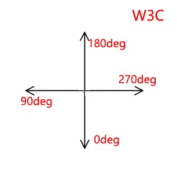
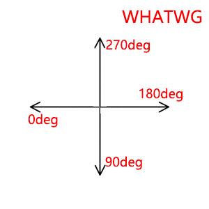

# CSS3笔记
css3的新特性：选择器、盒模型、圆角、盒子阴影，重要的三大模块：变形、过渡、动画

## 选择器

### 属性选择器
属性选择器的兼容是从IE7开始兼容，所以目前大部分都可以使用
- el[attr] 选择具有attr属性的元素
- el[attr="value"] 选择attr属性的值为value的元素，两个条件都满足：attr、value
- el[attr*="value"] 选择attr属性值中包含value的元素
- el[attr^="value"] 选择attr属性值以value开头的元素
- el[attr$="value"] 选择attr属性值以value结尾的元素
- el[attr~="value"] 选择attr属性值为value或者value是一个单独独立的部分(如:以空格分隔的)
- el[attr|="value"] 选择attr属性值为value或者是以value-开头的元素

属性选择器中的属性是可以一次性写多个，即满足多个属性:el[attr1][attr2]

### 关系选择器
通过元素之间的关系来进行选择
- el1 el2 后代选择器，所有浏览器都兼容
- el1>el2 元素1的儿子或者女儿，IE7开始兼容
- el1+el2 元素1后面紧挨着元素2，兼容同上
- el1~el2 元素1后面的所有直接子元素，兼容同上

### 伪类选择器
- :root 选择文档根标签(同html标签选择器)
- el:nth-child(n) 选择元素是其父元素的第n个孩子，IE9开始支持
- el:first-child 选择元素是其父元素的第一个子元素，IE7开始支持
- el:last-child 选择元素是其父元素的最后一个子元素，IE9开始支持
- el:nth-last-child(n) 选择元素是其父元素倒数第n个子元素
- el:only-child 选择元素是其父元素的独生子女元素，即只有一个孩子
- el:nth-child(2n) el:nth-child(even) 选择元素是其父元素中排行为偶数的的孩子
- el:nth-child(2n+1) el:nth-child(odd) 选择元素是其父元素中排行为奇数的的孩子
- el:nth-child(-n+3) 选择元素是在其父元素中排行前三的子元素

- el:nth-of-type(n) 选择元素在其父元素中的同类孩子中的第n个孩子
- el:first-of-type 选择元素在其父元素中的同类孩子中排行第一的孩子
- el:nth-last-of-type(n) 选择元素为其父元素中的同类孩子中倒数第n个孩子
- el:only-of-type 选择元素为其父元素中的同类孩子中唯一一个孩子
- el:nth-of-type(2n) el:nth-of-type(even)  选择元素为其父元素中的同类孩子中为偶数的孩子
- el:nth-of-type(2n+1) el:nth-of-type(odd)  选择元素为其父元素中的同类孩子中为奇数的孩子
- el:nth-of-type(-n+2) 选择元素为其父元素中的同类孩子中排行前二的孩子

- :hover 鼠标悬停，IE6只支持a元素，从IE7开始所有元素都支持hover
- :active 激活状态时，IE6和7中只支持a，IE8开始所有元素支持
- el:focus 元素获取焦点时，IE8开始兼容
- el:checked 表单元素被选中时
- el:disabled 表单元素禁用时
- el:enabled 表单元素可用时
- :lang(zh) 当处于某种语言时，IE8开始支持
- :empty 选中没有子元素的元素
- :not(css选择器) 取反
- :target 锚记处于当前状态时

以上选择器中如果没有标注则从IE9开始支持。

### 伪元素选择器
- el:before el::before 在元素的所有子元素前，一个冒号的写法从IE8开始支持，两个从IE9开始支持
- el:after el::after  在元素的所有子元素后，同上
- el:first-letter el::first-letter 元素的第一个字符，一个冒号的写法从IE6开始支持，两个从IE9开始支持
- el:first-line el::first-line 元素的第一行，同上
- ::selection 元素被选中时，IE9开始支持，设置个别的元素需要直接作用于元素身上，如果所有元素都要则设置为全局的即::selection

## 新属性

### 颜色
- rgba()  a表示不透明度，1表示完全不透明，0表示完全透明
- hsl()  h色相 s饱和度 l亮度
- hsla() h色相 s饱和度 l亮度 a不透明度

### 圆角
标准表示法：border-radius:px | %，通常为了兼容都需要加上兼容前缀
- 设置一个值 表示四个角圆角相同
- 设置两个值 第一个值表示左上和右下角，第二个值表示右上和左下角
- 设置三个值 第一个值为左上角，第二个值为右上和左下，第三个值为右下
- 设置四个值 从左上角开始，顺时针依次设置

也可以单独给每个角设置：
- border-top-left-radius 左上角
- border-top-right-radius 右上角
- border-bottom-left-radius 左下角
- border-bottom-right-radius 右下角

如果是一个正方形，其圆角值大于或者等于宽高一半时变成一个正圆
如果是一个长方形，其圆角值大于或者等于宽高一半时变成一个胶囊圆角
如果设置百分比，横向为盒子宽度的百分比，纵向为盒子高度的百分比，如果是长方形其值大于或者等于50%变成一个椭圆

### 阴影

#### 盒子阴影
box-shadow：右 下 羽化值(模糊程度) 延展度 阴影颜色 inset(内阴影)
- 阴影默认字体的颜色
- 阴影不占空间
- 一个盒子可以有多个阴影
- 盒子阴影从IE9开始支持

#### 文字阴影
text-shadow:右 下 羽化值(模糊程度) 阴影颜色
- 文字阴影没有延展度和内外阴影，其他和盒子阴影一样
- 文字阴影从IE10开始支持

### 背景
- background-color 背景色
- background-image 背景图
- background-repeat 背景图平铺
- background-position 背景图定位
- background-attachment 设置背景图是否随滚动条滚动而滚动，默认值scroll，fixed表示固定
- background-origin 背景起源，padding-box背景定位相对于内边距盒子，border-box相对于边框盒子定位，content-box相对于内容盒子定位
- background-clip 背景裁剪，padding-box背景按照内边距盒子裁剪，border-box按照边框盒子裁剪，content-box按照内容盒子裁剪，通常和background-origin搭配使用
- background-size:px | % | cover | contain 背景大小,默认以原始大小呈现，取值设置为px则按照设置来呈现；设置百分比则宽度为盒子宽度的百分比，高为盒子高度的百分比；设置为百分比和auto则为百分比按照设置方向的百分比，auto方向则为自动等比缩放；设置为cover则为缩放背景图刚好覆盖盒子；设置为contain保证显示一张完整图片的情况下缩放盒子到等宽或等高

#### 背景渐变
- background-image:linear-gradient(开始和结束位置方位名称或者度数(deg)，颜色值1，颜色值2....) 线性渐变
ps:对于线性渐变如果写方位名称w3c标准和WHATWG的写法不一样，w3c是在方位名称前加to 结束方位名称，WHATWG则是起始方位名称，如果写数值也不一样，两者坐标系不同，所以起始度数要不相同，如下图：

例子：
~~~
div:first-child{
    background-image:-webkit-linear-gradient(left,red,blue);
    background-image:-moz-linear-gradient(left,red,blue);
    background-image:-ms-linear-gradient(left,red,blue);
    background-image:-o-linear-gradient(left,red,blue);
    background-image:linear-gradient(to right,red,blue);
}
div:nth-child(3){
    background-image:-webkit-linear-gradient(left top,red,blue);
    background-image:-moz-linear-gradient(left top,red,blue);
    background-image:-ms-linear-gradient(left top,red,blue);
    background-image:-o-linear-gradient(left top,red,blue);
    background-image:linear-gradient(to right bottom,red,blue);
}
div:nth-child(5){
    background-image:-webkit-linear-gradient(top,red,blue,orange,green);
    background-image:-moz-linear-gradient(top,red,blue,orange,green);
    background-image:-ms-linear-gradient(top,red,blue,orange,green);
    background-image:-o-linear-gradient(top,red,blue,orange,green);
    background-image:linear-gradient(to bottom,red,blue,orange,green);
}
div:nth-child(6){
    background-image:-webkit-linear-gradient(top,red,blue 20%,orange,green 240px);
    background-image:-moz-linear-gradient(top,red,blue 20%,orange,green 240px);
    background-image:-ms-linear-gradient(top,red,blue 20%,orange,green 240px);
    background-image:-o-linear-gradient(top,red,blue 20%,orange,green 240px);
    background-image:linear-gradient(to bottom,top,red,blue 20%,orange,green 240px);
}
div:nth-child(7){
    background-image:-webkit-linear-gradient(163deg, red, blue);
    background-image:-moz-linear-gradient(163deg, red, blue);
    background-image:-ms-linear-gradient(163deg, red, blue);
    background-image:-o-linear-gradient(163deg, red, blue);
    background-image:linear-gradient(287deg, red, blue);
}
~~~

- background-image:radial-gradient(渐变中心点横坐标 渐变中心点的纵坐标,颜色值1,颜色值2) 径向渐变

ps:颜色值可以为%或者px表示颜色值出现的位置，目前兼容性不好大部分浏览器不支持

#### 多背景
从IE9开始，一个盒子可以携带多个背景，多个背景之间以逗号分隔
~~~
div{
    background:url("images/ab.png") content-box,url('images/xiaoming.jpg') padding-box,orange;
}
~~~

## 过渡动画

- 过渡动画的格式：transition:发生过渡动画的属性名 完成过渡动画的时间 缓动曲线，延迟时间，或者单个写：transition-property属性名 transition-duration过渡动画时间 transition-timing-function缓动曲线 transition-delay延迟时间
- 可以发生过渡动画的属性：凡是有值可以转化为数值的属性都可以，chrome中背景图也可以发生过渡动画
~~~
div{
    width: 100px;
    height: 100px;
    line-height: 100px;
    border:1px solid black;
    transition: all 1s ease 0s;
    text-align: center;
}
div:hover{
    height: 300px;
    width: 300px;
    border-radius:300px;
    line-height: 300px;
    border:10px solid blue;
    box-shadow: 20px 30px 30px 40px red;
}
~~~

## 变形

### 二维变形

#### 旋转变形
语法：transform:rotate(deg) 参数为旋转的度数，如果为正值则为顺时针旋转,如果为负值则为逆时针旋转

#### 斜切变形
语法：transform:skew(水平方向斜切角度,垂直方向斜切角度)

#### 缩放变形
语法：transform:scale(x轴缩放比例,y轴缩放比例)，不可使用%，只有一个值则两个方向缩放相等的比例

#### 位移变形
语法：transform:translate(向x轴正向平移的距离,向y轴正向平移的距离)，平移距离取值可以是像素也可以是百分比，如果为百分比则相对自己而言

#### 变形中心点的控制
语法：transform-origin:变形中心点的横坐标 变形中心点的纵坐标，取值可为方位名词、具体像素、百分比，一定要给默认样式加

### 三维变形
三维变形需要加景深，这样会产生一个近大远小、近实远虚的透视效果，perspective:px,需要给不变的元素加即承载变形元素的盒子

#### 旋转变形
- transform:rotate() transform:rotateZ() 默认的是绕z轴旋转，如果为正值则是顺时针旋转，如果为负值则是逆时针旋转
- transform:rotateX() 绕x轴旋转，如果为正值是点头，如果为负值则是仰头
- transform;rotateY() 绕y轴旋转，如果为正值是向右旋转，如果为负值则向左旋转
-
#### 位移变形
transform:translate3D(x,y,z) 3D位移，三个参数分别为三个方向的正向位移，也可以分开写：transform:translateX(x),transform:translateY(x),transform:translateZ(z)

#### 构建立方体
构建立方体需要加transform-style属性，需要加在父元素上，transfrom-style:flat(让子元素以二维平面显示，默认) | preserve-3d(让子元素以三维立体呈现)

#### 透视点控制
透视点控制需要属性perspective-origin:px | % | 方位名词，默认值为center center，需要设置两个值，第一个为x轴坐标，第二个为y轴坐标

## 动画
定义动画:animation:自定义动画名称 动画时长 缓动曲线延迟时长 是否停留在终点（forwards表示停留在终点) 运行的次数(默认为1次,infinite表示无数次) 是否交替运行(alternate)
~~~
div:nth-child(2) span{
    width: 224px;
    height: 224px;
    display: block;
    background: url(images/52/fengche.png);
    animation: xuanzhuan 2s linear 0s infinite;
}
@keyframes xuanzhuan{
    from{
        transform: rotateZ(0deg);
    }
    to{
        transform: rotateZ(-360deg);
    }
}
~~~

